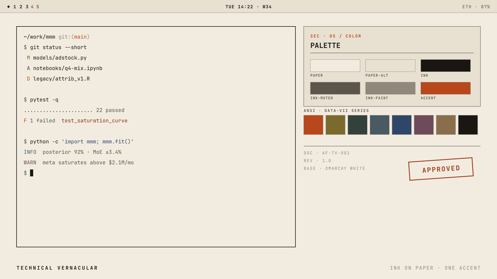

# Technical Vernacular

An [Omarchy](https://omarchy.org/) theme. Ink on paper, one vermillion accent.

Derived from the AF-BG-001 personal brand system (rev 1.0), built on Omarchy's
stock "White" theme. It is a **light** theme: warm paper ground, near-black ink
that is never pure black, and a single accent used only for emphasis.



## Palette

| Role | Hex | Notes |
|------|-----|-------|
| Paper | `#F2ECE0` | terminal ground |
| Paper-alt | `#E8E1D2` | secondary surface |
| Ink | `#1A1712` | body text, active borders |
| Ink-faint | `#8F887B` | muted text, inactive borders |
| Accent | `#B8471C` | vermillion — emphasis only |
| Stamp | `#A03A18` | error text (5.73:1 on paper) |

ANSI slots map to the brand guide's data-viz extension (SERIES 01–06). Every
slot measures at least 4.5:1 against Paper.

## Design rules encoded here

- **Rule 02, earn every mark.** A line either separates two things or it should
  not be there. Window gaps are 2 in / 6 out.
- **Focus is value, not hue.** Active vs. inactive borders differ by Ink vs.
  Ink-faint, so the distinction survives greyscale and never becomes a second
  accent colour.
- **One accent, one job.** Vermillion marks the focused lock field and nothing
  else on that surface.

## Install

This theme ships a `hyprland.lua`, and Omarchy will not load Lua from a theme it
cloned itself. `omarchy theme set` treats any theme directory containing a
`.git` as untrusted and stages no `.lua` from it at all, warning:

```
Ignored in ~/.config/omarchy/themes/technical-vernacular: hyprland.lua
A theme installed from a git repo cannot supply Lua, a terminal config, or vscode.json.
```

So `omarchy theme install` gets the palette but leaves the window chrome — the
border colours and the 2/6 gaps — at Omarchy's defaults. Clone and symlink
instead; a symlinked theme is your own working copy, which Omarchy trusts:

```bash
git clone https://github.com/ale-fuenmayor/omarchy-technical-vernacular-theme \
  ~/Projects/omarchy-technical-vernacular-theme
ln -s ~/Projects/omarchy-technical-vernacular-theme \
  ~/.config/omarchy/themes/technical-vernacular
omarchy theme set technical-vernacular
```

Update with a pull and a re-apply:

```bash
git -C ~/Projects/omarchy-technical-vernacular-theme pull
omarchy theme set technical-vernacular
```

`omarchy theme update` does **not** cover this theme. It pulls only the themes
Omarchy cloned itself and skips symlinks by design, so it would report nothing
and quietly leave the theme unchanged.

### Palette only

If you don't want the window chrome, the one-line install is fine — everything
except `hyprland.lua` applies, and `omarchy theme update` then works normally:

```bash
omarchy theme install https://github.com/ale-fuenmayor/omarchy-technical-vernacular-theme
omarchy theme set technical-vernacular
```

## Files

| File | Purpose |
|------|---------|
| `colors.toml` | core palette consumed by Omarchy's theme engine |
| `hyprland.lua` | window chrome — border colours, gaps, groupbar (needs the symlink install) |
| `shell.lock.toml` | lock screen surface |
| `btop.theme`, `chromium.theme`, `icons.theme` | app theming |
| `backgrounds/` | paper, blueprint and survey wallpapers |

## Gotcha

Keep comments in `colors.toml` on their **own lines**. A trailing `#` comment
after a colour value (`accent = "#B8471C"  # vermillion`) breaks downstream
parsers that read this file — Omacalc renders a black window rather than
failing loudly. `shell.lock.toml` is read by a different parser and tolerates
trailing comments, which is why it uses them.
